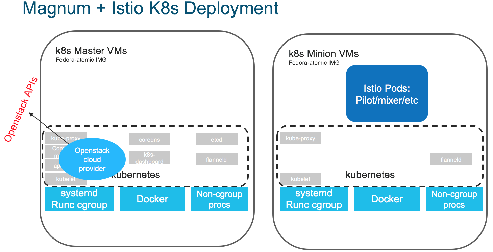
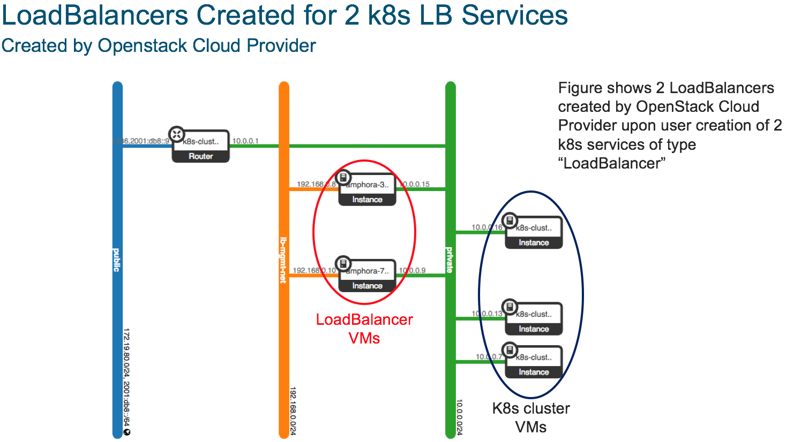

# Bringup:  Istio on Openstack Magnum (devstack)

Details of a bringup of Istio in a k8s cluster created with Openstack Magnum+Octavia in a devstack AIO.
The details of the devstack Magnum bringup and SW versions used are [here](magnum.md)

## References
1. [Magnum Dev Quickstart](https://docs.openstack.org/magnum/latest/contributor/quickstart.html)
1. [Magnum Troubleshooting](https://docs.openstack.org/magnum/latest/admin/troubleshooting-guide.html)
1. [Octavia (LBaaS)](https://docs.openstack.org/octavia/latest/reference/introduction.html)
1. [Neutron LBaaS Cmds](https://docs.openstack.org/neutron/pike/admin/config-lbaas.html)
1. [Istio Quick Start](https://istio.io/docs/setup/kubernetes/quick-start.html)
1. [Istio Sidecar Injection](https://istio.io/docs/setup/kubernetes/sidecar-injection.html)

## Resulting k8s + Istio



### Istio Version Info
The `getLatestIstio` mechanism was used to pull the latest release Istio k8s manifest and istioctl binary.  At the time of this example bringup the Istio latest release version is `istio-0.5.1`.

## Bring Up Flow
1. k8s Cluster Admin Steps
   1. Create a k8s cluster
   1. Gain k8s cluster admin access
   1. Install istio control-plane on k8s cluster
   1. (optional) setup floating IP for istio-ingress service VIP 
1. k8s Cluster User Steps
   1. Setup k8s user credentials
   1. install istioctl
   1. create k8s deployments/pods with istio sidecars injected
   
## k8s Cluster Admin Details
### Create k8s Cluster via Magnum
The following creates a 2 node cluster--1 master VM, 1 minion VM.  Steps are pretty much straight out of [Magnum Dev Quickstart](https://docs.openstack.org/magnum/latest/contributor/quickstart.html)

```shell
test -f ~/.ssh/id_rsa.pub || ssh-keygen -t rsa -N "" -f ~/.ssh/id_rsa
nova keypair-add --pub-key ~/.ssh/id_rsa.pub testkey

NAMESERVER=8.8.8.8
MAG_FLAV=m1.small
ATOM_IMG=$(openstack image list -f value -c Name | grep -i $atomic_image || true)
magnum cluster-template-create --name k8s-cluster-template --image $ATOM_IMG --keypair testkey --external-network public --dns-nameserver $NAMESERVER --flavor $MAG_FLAV --docker-volume-size 5 --network-driver flannel --coe kubernetes

magnum cluster-create --name k8s-cluster --cluster-template k8s-cluster-template --node-count 1

# poll cluster-list to cluster reaching CREATE_COMPLETE
magnum cluster-list

```

## k8s Admin: Install Istio

The k8s RBAC credentials setup by magnum don't give full cluster-admin access to the k8s cluster.  The Istio
control-plane install requires setting up cluster-wide roles and bindings--`kind: ClusterRole` & `kind: ClusterRoleBinding`.

To gain sufficient authorization ssh to the master VM and sudo to root--if my understanding of k8s RBAC bootstrap
is correct, that gains access as the node service-account.  

Use the openstack API to find the FIP bound to the k8s master VM: 
```shell
openstack server list
# get the FIP

ssh fedora@<master FIP>
```

### Install Istio

This example grabs the latest Istio release and installs the non-auth manifest (core only/no add-ons).

```shell
# become root user
sudo su -
curl -L https://git.io/getLatestIstio | sh -
kubectl apply -f istio-0.5.1/install/kubernetes/istio.yaml

```

At this point the Istio control-plane pods should come up and the istio-ingress service (type Loadbalancer)
will cause the openstack cloud-provider to create an openstack load-balancer and add the istio-ingress pods'
nodes as lbaas pool members.  

```shell
# check the status of the pods
kubectl get pods -n istio-system

# watch istio-ingress service to see if it gets External IP from openstack cloud-provider (using Octavia)
# NOTE: this external IP for matching with the neutron LBaaS output to find the right neutron loadbalancer
kubectl get svc istio-ingress -n istio-system


```

#### Example

```shell

[fedora@k8s-cluster-g4qej2tssh7t-master-0 ~]$ curl -L https://git.io/getLatestIstio | sh -
  % Total    % Received % Xferd  Average Speed   Time    Time     Time  Current
                                 Dload  Upload   Total   Spent    Left  Speed
  0     0    0     0    0     0      0      0 --:--:-- --:--:-- --:--:--     0
100  1448  100  1448    0     0   1585      0 --:--:-- --:--:-- --:--:--  1585
Downloading istio-0.5.1 from https://github.com/istio/istio/releases/download/0.5.1/istio-0.5.1-linux.tar.gz ...
  % Total    % Received % Xferd  Average Speed   Time    Time     Time  Current
                                 Dload  Upload   Total   Spent    Left  Speed
100   614    0   614    0     0   1486      0 --:--:-- --:--:-- --:--:--  1490
100 10.5M  100 10.5M    0     0  5662k      0  0:00:01  0:00:01 --:--:-- 9552k
Downloaded into istio-0.5.1:
bin  install  istio.VERSION  LICENSE  README.md  samples  tools
Add /home/fedora/istio-0.5.1/bin to your path; e.g copy paste in your shell and/or ~/.profile:
export PATH="$PATH:/home/fedora/istio-0.5.1/bin"

[fedora@k8s-cluster-g4qej2tssh7t-master-0 ~]$ cd istio-0.5.1/
[fedora@k8s-cluster-g4qej2tssh7t-master-0 istio-0.5.1]$ ls
bin  install  istio.VERSION  LICENSE  README.md  samples  tools
[fedora@k8s-cluster-g4qej2tssh7t-master-0 istio-0.5.1]$ kubectl apply -f install/kubernetes/istio.yaml
2018-02-14 16:49:29.078776 I | proto: duplicate proto type registered: google.protobuf.Any
2018-02-14 16:49:29.079044 I | proto: duplicate proto type registered: google.protobuf.Duration
2018-02-14 16:49:29.079126 I | proto: duplicate proto type registered: google.protobuf.Timestamp
namespace "istio-system" created
clusterrole "istio-pilot-istio-system" created
clusterrole "istio-sidecar-injector-istio-system" created
clusterrole "istio-mixer-istio-system" created
clusterrole "istio-ca-istio-system" created
clusterrole "istio-sidecar-istio-system" created
clusterrolebinding "istio-pilot-admin-role-binding-istio-system" created
clusterrolebinding "istio-sidecar-injector-admin-role-binding-istio-system" created
clusterrolebinding "istio-ca-role-binding-istio-system" created
clusterrolebinding "istio-ingress-admin-role-binding-istio-system" created
clusterrolebinding "istio-sidecar-role-binding-istio-system" created
clusterrolebinding "istio-mixer-admin-role-binding-istio-system" created
configmap "istio-mixer" created
service "istio-mixer" created
serviceaccount "istio-mixer-service-account" created
deployment "istio-mixer" created
customresourcedefinition "rules.config.istio.io" created
customresourcedefinition "attributemanifests.config.istio.io" created
customresourcedefinition "circonuses.config.istio.io" created
customresourcedefinition "deniers.config.istio.io" created
customresourcedefinition "fluentds.config.istio.io" created
customresourcedefinition "kubernetesenvs.config.istio.io" created
customresourcedefinition "listcheckers.config.istio.io" created
customresourcedefinition "memquotas.config.istio.io" created
customresourcedefinition "noops.config.istio.io" created
customresourcedefinition "opas.config.istio.io" created
customresourcedefinition "prometheuses.config.istio.io" created
customresourcedefinition "rbacs.config.istio.io" created
customresourcedefinition "servicecontrols.config.istio.io" created
customresourcedefinition "stackdrivers.config.istio.io" created
customresourcedefinition "statsds.config.istio.io" created
customresourcedefinition "stdios.config.istio.io" created
customresourcedefinition "apikeies.config.istio.io" created
customresourcedefinition "authorizations.config.istio.io" created
customresourcedefinition "checknothings.config.istio.io" created
customresourcedefinition "kuberneteses.config.istio.io" created
customresourcedefinition "listentries.config.istio.io" created
customresourcedefinition "logentries.config.istio.io" created
customresourcedefinition "metrics.config.istio.io" created
customresourcedefinition "quotas.config.istio.io" created
customresourcedefinition "reportnothings.config.istio.io" created
customresourcedefinition "servicecontrolreports.config.istio.io" created
customresourcedefinition "tracespans.config.istio.io" created
customresourcedefinition "serviceroles.config.istio.io" created
customresourcedefinition "servicerolebindings.config.istio.io" created
attributemanifest "istioproxy" created
attributemanifest "kubernetes" created
stdio "handler" created
logentry "accesslog" created
rule "stdio" created
metric "requestcount" created
metric "requestduration" created
metric "requestsize" created
metric "responsesize" created
metric "tcpbytesent" created
metric "tcpbytereceived" created
prometheus "handler" created
rule "promhttp" created
rule "promtcp" created
kubernetesenv "handler" created
rule "kubeattrgenrulerule" created
kubernetes "attributes" created
configmap "istio" created
customresourcedefinition "destinationpolicies.config.istio.io" created
customresourcedefinition "egressrules.config.istio.io" created
customresourcedefinition "routerules.config.istio.io" created
service "istio-pilot" created
serviceaccount "istio-pilot-service-account" created
deployment "istio-pilot" created
service "istio-ingress" created
serviceaccount "istio-ingress-service-account" created
deployment "istio-ingress" created
serviceaccount "istio-ca-service-account" created
deployment "istio-ca" created

[fedora@k8s-cluster-g4qej2tssh7t-master-0 istio-0.5.1]$ kubectl get pods --all-namespaces -o wide
2018-02-14 16:50:18.334474 I | proto: duplicate proto type registered: google.protobuf.Any
2018-02-14 16:50:18.334865 I | proto: duplicate proto type registered: google.protobuf.Duration
2018-02-14 16:50:18.334967 I | proto: duplicate proto type registered: google.protobuf.Timestamp
NAMESPACE      NAME                                    READY     STATUS              RESTARTS   AGE       IP            NODE
istio-system   istio-ca-694467614-161j0                1/1       Running             0          42s       10.100.43.5   k8s-cluster-g4qej2tssh7t-minion-0
istio-system   istio-ingress-3668491357-4zr70          0/1       ContainerCreating   0          42s       <none>        k8s-cluster-g4qej2tssh7t-minion-0
istio-system   istio-mixer-3090152654-03xcw            0/3       ContainerCreating   0          48s       <none>        k8s-cluster-g4qej2tssh7t-minion-0
istio-system   istio-pilot-686435155-6rk80             0/2       ContainerCreating   0          42s       <none>        k8s-cluster-g4qej2tssh7t-minion-0
kube-system    coredns-1977636023-9m271                1/1       Running             0          49m       10.100.43.2   k8s-cluster-g4qej2tssh7t-minion-0
kube-system    kubernetes-dashboard-3804488410-11p58   1/1       Running             0          49m       10.100.43.3   k8s-cluster-g4qej2tssh7t-minion-0

[fedora@k8s-cluster-g4qej2tssh7t-master-0 istio-0.5.1]$ kubectl get pods --all-namespaces -o wide
2018-02-14 16:54:26.912617 I | proto: duplicate proto type registered: google.protobuf.Any
2018-02-14 16:54:26.912883 I | proto: duplicate proto type registered: google.protobuf.Duration
2018-02-14 16:54:26.912963 I | proto: duplicate proto type registered: google.protobuf.Timestamp
NAMESPACE      NAME                                    READY     STATUS    RESTARTS   AGE       IP            NODE
istio-system   istio-ca-694467614-161j0                1/1       Running   0          4m        10.100.43.5   k8s-cluster-g4qej2tssh7t-minion-0
istio-system   istio-ingress-3668491357-4zr70          1/1       Running   0          4m        10.100.43.7   k8s-cluster-g4qej2tssh7t-minion-0
istio-system   istio-mixer-3090152654-03xcw            3/3       Running   0          4m        10.100.43.4   k8s-cluster-g4qej2tssh7t-minion-0
istio-system   istio-pilot-686435155-6rk80             2/2       Running   0          4m        10.100.43.6   k8s-cluster-g4qej2tssh7t-minion-0
kube-system    coredns-1977636023-9m271                1/1       Running   0          53m       10.100.43.2   k8s-cluster-g4qej2tssh7t-minion-0
kube-system    kubernetes-dashboard-3804488410-11p58   1/1       Running   0          53m       10.100.43.3   k8s-cluster-g4qej2tssh7t-minion-0

[fedora@k8s-cluster-g4qej2tssh7t-master-0 istio-0.5.1]$ kubectl get services -o wide --all-namespaces
2018-02-14 16:58:34.262193 I | proto: duplicate proto type registered: google.protobuf.Any
2018-02-14 16:58:34.262416 I | proto: duplicate proto type registered: google.protobuf.Duration
2018-02-14 16:58:34.262487 I | proto: duplicate proto type registered: google.protobuf.Timestamp
NAMESPACE      NAME                   CLUSTER-IP       EXTERNAL-IP   PORT(S)                                                            AGE       SELECTOR
default        kubernetes             10.254.0.1       <none>        443/TCP                                                            57m       <none>
istio-system   istio-ingress          10.254.106.41    10.0.0.5      80:31121/TCP,443:30315/TCP                                         8m        istio=ingress
istio-system   istio-mixer            10.254.194.128   <none>        9091/TCP,15004/TCP,9093/TCP,9094/TCP,9102/TCP,9125/UDP,42422/TCP   9m        istio=mixer
istio-system   istio-pilot            10.254.6.204     <none>        15003/TCP,8080/TCP,9093/TCP,443/TCP                                8m        istio=pilot
kube-system    kube-dns               10.254.0.10      <none>        53/UDP,53/TCP                                                      57m       k8s-app=coredns
kube-system    kubernetes-dashboard   10.254.175.78    <nodes>       80:30634/TCP                                                       57m       app=kubernetes-dashboard

```

### Create Floating-IP for istio-ingress

This step is only needed if services behind the istio-ingress need to be available from outside the
openstack tenant network.


```shell
# Find the neutron LBaaS loadbalancer created for istio-ingress
#  - look for the VIP given as External IP to k8s istio-ingress service
neutron lbaas-loadbalancer-list

# Find the vip_port_id for the loadbalancer 
neutron lbaas-loadbalancer-show <lb ID>

# create a floating IP on the public network (for access from outside openstack)
# -- keep track of the ID for the created FIP
neutron floatingip-create public

# associate the new FIP to the loadbalancer VIP on the tenant network
neutron floatingip-associate  <fip ID> <vip_port_id>

# Now the istio-ingress service is reachable from the openstack public network

```

#### Example

```shell
stack@bxb-r8-vtsctrl:~/devstack$ neutron lbaas-loadbalancer-show  a0a1dca8211a711e891b5fa163ecd2f9
neutron CLI is deprecated and will be removed in the future. Use openstack CLI instead.
+---------------------+--------------------------------------------------------------+
| Field               | Value                                                        |
+---------------------+--------------------------------------------------------------+
| admin_state_up      | True                                                         |
| description         | Kubernetes external service a0a1dca8211a711e891b5fa163ecd2f9 |
| id                  | 490406c4-2ee1-4bae-bd43-8538fe589b5f                         |
| listeners           | {"id": "41a6a9f1-2ca3-4508-b7e9-1162d064c7ed"}               |
|                     | {"id": "99452247-5fa9-4a3a-bd35-b1315101c468"}               |
| name                | a0a1dca8211a711e891b5fa163ecd2f9                             |
| operating_status    | ONLINE                                                       |
| pools               | {"id": "f9dfa87e-1f2f-4a23-9b4d-0ec70a6232c1"}               |
|                     | {"id": "799fcd39-bc53-47af-b271-83fb77164a02"}               |
| provider            | octavia                                                      |
| provisioning_status | ACTIVE                                                       |
| tenant_id           | 248bbe0ccffd46e4924bdc553bf5ec99                             |
| vip_address         | 10.0.0.5                                                     |
| vip_port_id         | d168e0fd-1fc6-457a-a69a-c050b4aa1451                         |
| vip_subnet_id       | 174a51ef-5469-4ef0-8434-d9ddc7dbd0f2                         |
+---------------------+--------------------------------------------------------------+

stack@bxb-r8-vtsctrl:~/devstack$ neutron floatingip-create public
neutron CLI is deprecated and will be removed in the future. Use openstack CLI instead.
Created a new floatingip:
+---------------------+--------------------------------------+
| Field               | Value                                |
+---------------------+--------------------------------------+
| created_at          | 2018-02-14T17:11:13Z                 |
| description         |                                      |
| fixed_ip_address    |                                      |
| floating_ip_address | 172.19.80.143                        |
| floating_network_id | c5778f89-746f-425c-bf06-5ff044201759 |
| id                  | 731c74ed-3ca3-465b-a674-5b6970a7d5f1 |
| port_id             |                                      |
| project_id          | 248bbe0ccffd46e4924bdc553bf5ec99     |
| revision_number     | 0                                    |
| router_id           |                                      |
| status              | DOWN                                 |
| tags                |                                      |
| tenant_id           | 248bbe0ccffd46e4924bdc553bf5ec99     |
| updated_at          | 2018-02-14T17:11:13Z                 |
+---------------------+--------------------------------------+
stack@bxb-r8-vtsctrl:~/devstack$ neutron floatingip-associate  731c74ed-3ca3-465b-a674-5b6970a7d5f1 d168e0fd-1fc6-457a-a69a-c050b4aa1451
neutron CLI is deprecated and will be removed in the future. Use openstack CLI instead.
Associated floating IP 731c74ed-3ca3-465b-a674-5b6970a7d5f1


```

## Using the k8s Cluster

### Setting up k8s user access (.kube/config)

The sets up a kubernetes client config file with user credentials given by magnum.
Steps are pretty much straight out of [Magnum Dev Quickstart](https://docs.openstack.org/magnum/latest/contributor/quickstart.html)

```shell
openssl genrsa -out client.key 4096
cat > client.conf << END
[req]
distinguished_name = req_distinguished_name
req_extensions     = req_ext
prompt = no
[req_distinguished_name]
CN = Your Name
[req_ext]
extendedKeyUsage = clientAuth
END
openssl req -new -days 365     -config client.conf     -key client.key     -out client.csr
magnum ca-sign --cluster k8s-cluster --csr client.csr > client.crt
magnum ca-show --cluster k8s-cluster > ca.crt
eval $(magnum cluster-config k8s-cluster)

# the resulting kubernetes config is pointed to by the shell's KUBECONFIG var
env | grep KUBECONFIG

# to use kubectl from any other shells add the KUBECONFIG setting there as well

```

### Deploy istio sample app "bookinfo" with injected sidecars

```shell

# get istio example manifests and istioctl
curl -L https://git.io/getLatestIstio | sh -

# setup istioctl via running the export command output above
# ie.
export PATH="$PATH:/opt/stack/istio-0.5.1/bin"

# deploy bookinfo with injected sidecars
kubectl apply -f <( istioctl kube-inject -f bookinfo.yaml )

```

#### Example Deploy

```shell
stack@bxb-r8-vtsctrl:~$ curl -L https://git.io/getLatestIstio | sh -
  % Total    % Received % Xferd  Average Speed   Time    Time     Time  Current
                                 Dload  Upload   Total   Spent    Left  Speed
  0     0    0     0    0     0      0      0 --:--:-- --:--:-- --:--:--     0
100  1448  100  1448    0     0   1795      0 --:--:-- --:--:-- --:--:-- 23354
Downloading istio-0.5.1 from https://github.com/istio/istio/releases/download/0.5.1/istio-0.5.1-linux.tar.gz ...
  % Total    % Received % Xferd  Average Speed   Time    Time     Time  Current
                                 Dload  Upload   Total   Spent    Left  Speed
100   614    0   614    0     0   1691      0 --:--:-- --:--:-- --:--:--  1696
100 10.5M  100 10.5M    0     0  6910k      0  0:00:01  0:00:01 --:--:-- 10.0M
Downloaded into istio-0.5.1:
bin  install  istio.VERSION  LICENSE  README.md  samples  tools
Add /opt/stack/istio-0.5.1/bin to your path; e.g copy paste in your shell and/or ~/.profile:
export PATH="$PATH:/opt/stack/istio-0.5.1/bin"
stack@bxb-r8-vtsctrl:~$ export PATH="$PATH:/opt/stack/istio-0.5.1/bin"
stack@bxb-r8-vtsctrl:~$ which istioctl
/opt/stack/istio-0.5.1/bin/istioctl

stack@bxb-r8-vtsctrl:~/istio-0.5.1/samples/bookinfo/kube$ kubectl apply -f <( istioctl kube-inject -f bookinfo.yaml )
service "details" created
deployment "details-v1" created
service "ratings" created
deployment "ratings-v1" created
service "reviews" created
deployment "reviews-v1" created
deployment "reviews-v2" created
deployment "reviews-v3" created
service "productpage" created
deployment "productpage-v1" created
ingress "gateway" created

stack@bxb-r8-vtsctrl:~/istio-0.5.1/samples/bookinfo/kube$ kubectl get pods -o wide
NAME                             READY     STATUS    RESTARTS   AGE       IP             NODE
details-v1-3647646767-s93fx      2/2       Running   0          3m        10.100.43.8    k8s-cluster-g4qej2tssh7t-minion-0
productpage-v1-873983107-24hcr   2/2       Running   0          3m        10.100.43.13   k8s-cluster-g4qej2tssh7t-minion-0
ratings-v1-3165200403-x21rq      2/2       Running   0          3m        10.100.43.10   k8s-cluster-g4qej2tssh7t-minion-0
reviews-v1-13681461-3plrg        2/2       Running   0          3m        10.100.43.9    k8s-cluster-g4qej2tssh7t-minion-0
reviews-v2-91433049-2sc38        2/2       Running   0          3m        10.100.43.11   k8s-cluster-g4qej2tssh7t-minion-0
reviews-v3-1046185245-psg05      2/2       Running   0          3m        10.100.43.12   k8s-cluster-g4qej2tssh7t-minion-0


```


#### Test access to bookinfo app
The bookinfo app is available at `http://<istio ingress LB FIP>/productpage`

A sample curl to check the version of reviews returned:

```shell
curl http://172.19.80.143/productpage | grep font.color
```

Output showing no `font color=` is reviews-v1, `font color="black"` is reviews-v2, `font color="red"` is reviews-v3

##### Example

```shell
stack@bxb-r8-vtsctrl:~/istio-0.5.1/samples/bookinfo/kube$ curl http://172.19.80.143/productpage | grep font.color
  % Total    % Received % Xferd  Average Speed   Time    Time     Time  Current
                                 Dload  Upload   Total   Spent    Left  Speed
100  5719  100  5719    0     0   2114      0  0:00:02  0:00:02 --:-                <font color="red">
100  5719  100  5719    0     0   2114      0  0:00:02  0:00:02 --:--:--  2113
                <font color="red">
stack@bxb-r8-vtsctrl:~/istio-0.5.1/samples/bookinfo/kube$ curl http://172.19.80.143/productpage | grep font.color
  % Total    % Received % Xferd  Average Speed   Time    Time     Time  Current
                                 Dload  Upload   Total   Spent    Left  Speed
100  4415  100  4415    0     0   1898      0  0:00:02  0:00:02 --:--:--  1898
stack@bxb-r8-vtsctrl:~/istio-0.5.1/samples/bookinfo/kube$ curl http://172.19.80.143/productpage | grep font.color
  % Total    % Received % Xferd  Average Speed   Time    Time     Time  Current
                                 Dload  Upload   Total   Spent    Left  Speed
100  5723  100  5723    0     0  27962      0 --:--:-- --:--:-- --:--:-- 28053
                <font color="black">
                <font color="black">
```

## Example Openstack Net Topology -- 2 k8s loadbalancer services



## Extend Istio mesh to an Openstack Virtual Machine
After following all the aforementioned steps to get magnum, openstack and istio running, the next step is to extend the Istio service mesh across Openstack VM's to allow them to participate in the service mesh. We will use the same bookinfo example with a MySql backend served by a MySql server running inside an Openstack instance.

### Create a new glance image and Openstack instance
We need a new image to host the MySql instance. You can use any OS of your preference that can support a MySql server. For this document we use an Ubuntu 16.04 image. You can skip these steps if you already have such an image in you Openstack installation.

```shell
# wget https://cloud-images.ubuntu.com/xenial/current/xenial-server-cloudimg-amd64-disk1.img
# glance image-create --disk-format qcow2 --container-format bare --visibility public --file ./xenial-server-cloudimg-amd64-disk1.img  --name ubuntu_16.04
# 
```

### Create a new Openstack instance
Create a new instance. You can use the keypair that you created earlier for magnum.

```shell
# nova boot --flavor m1.medium --image ubuntu_16.04 --key-name testkey --nic net-id <your private network id> mysql
```

### Install Istio on the VM
Log in to the newly created Openstack instance and install the Istio package
```shell
# wget https://storage.googleapis.com/istio-release/releases/0.5.1/deb/istio-sidecar.deb
# sudo dpkg -i istio-sidecar.deb
# sudo mkdir -p /etc/certs
# sudo chown -R istio-proxy:istio-proxy /etc/certs
```

### Export and copy the Istio secrets
```shell
# export SA=istio.default
# kubectl get secret $SA -o jsonpath='{.data.cert-chain\.pem}' |base64 -d  > cert-chain.pem
# kubectl get secret $SA -o jsonpath='{.data.root-cert\.pem}' |base64 -d  > root-cert.pem
# kubectl get secret $SA -o jsonpath='{.data.key\.pem}' |base64 -d  > key.pem
# scp *.pem ubuntu@<your mysql instance ip>:/etc/certs/
```

### Setup DNS on the VM
Grab the cluster IP's of your Istio pods
```shell
# kubectl -n istio-system get po -o wide
```

### Add those IP addresses to the MySql VM
There are a few ways to do this, you can use dnsmasq and add the endpoints. For this document we just put the Istio endpoints inside /etc/hosts since the configuration is mostly static.

```shell
# vim /etc/hosts

10.100.45.3 istio-mixer istio-mixer.istio-system istio-mixer.istio-system.svc.cluster.local
10.100.45.2 istio-pilot istio-pilot.istio-system istio-pilot.istio-system.svc.cluster.local
10.100.79.4 istio-ca istio-ca.istio-system istio-ca.istio-system.svc.cluster.local
10.100.45.3 mixer-server mixer-server.istio-system
```

### Configure cluster.env and sidecar.env
On the MySql VM we need to configure the sidecar and cluster files

``` shell
# cd /var/lib/istio/envoy
# vim cluster.env

ISTIO_SERVICE_CIDR=<your kubernetes service cidr>
ISTIO_SYSTEM_NAMESPACE=istio-system
CONTROL_PLANE_AUTH_POLICY=None
```

```shell
# vim sidecar.env

ISTIO_SERVICE_CIDR=<your kubernetes service cidr>
ISTIO_INBOUND_PORTS=3306,8080
ISTIO_SVC_IP=<your VM's private IP address>
```

### Start Istio service within the MySql VM
Start the Istio services

```shell
# sudo service istio-auth-node-agent start
# sudo service istio start
```

Verify both services and envoy are running correctly
```shell
# sudo service istio-auth-node-agent status
# sudo service istio status
# ps -ef | grep -i envoy
```

### Setup MySql DB and access on the VM
We need to create the DB, tables, entries and access for bookinfo ratings on the Openstack MySql VM

```shell
# sudo apt-get update
# sudo apt-get install mysql-server
# sudo mysql
   ALTER USER 'root'@'localhost' IDENTIFIED WITH mysql_native_password BY 'password';
   # Remote 'root' can read test.*, to avoid
   # ERROR 1130 (HY000): Host '...' is not allowed to connect to this MySQL server
   create user 'root'@'%' IDENTIFIED WITH mysql_native_password BY 'password';
   GRANT SELECT ON test.* TO 'root'@'%';
# mysql -u root -h 127.0.0.1 --password=password < ~/github/istio/samples/bookinfo/src/mysql/mysqldb-init.sql
```

To be able to connect remotely
```shell
# sudo vi /etc/mysql/mysql.conf.d/mysqld.cnf
# comment out:
#bind-address   = 127.0.0.1
# sudo service mysql restart
```

### Cleanup any old bookinfo deployments and redeploy for mesh expansion
We should cleanup any old bookinfo deployment and routerules to avoid issues with testing mesh expansion
```shell
# cd <your istio root dir>
# kubectl delete -f samples/bookinfo/kube/
# kubectl apply -f <(istioctl kube-inject -f samples/bookinfo/kube/bookinfo.yaml)
# kubectl apply -f <(istioctl kube-inject -f samples/bookinfo/kube/bookinfo-mysql.yaml)
# kubectl apply -f <(istioctl kube-inject -f samples/bookinfo/kube/bookinfo-ratings-v2-mysql.yaml)
# kubectl apply -f <(istioctl kube-inject -f samples/bookinfo/kube/route-rule-ratings-mysql.yaml)
```

### Delete the mysqldb service in kubernetes
We will now delete the mysqldb service registered by the ratings-v2-mysql and recreate it pointing to our MySql VM

```shell
# kubectl delete svc mysqldb
# istioctl register -n default mysqldb <your MySql VM's ip address> 3306
```

### Test the VM backend
After registering the service, refresh your productpage and you should consistently see red stars in the ratings field. To test it, try to change the ratings of the books in the DB directly and refresh the page to see if the red stars update.

On the MySql VM
```shell
# mysql -u root -ppassword -e 'use test; update ratings set rating=1 where 1;'
```
